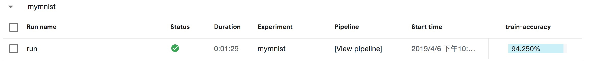

# 如何开发Kubeflow Pipelines

## 准备工作

机器学习工作流是一个任务驱动的流程，同时也是数据驱动的流程，这里涉及到数据的导入和准备，模型训练Checkpoint的导出评估，到最终模型的导出。这就需要分布式存储作为传输的媒介，这里使用NAS作为分布式存储。

- 创建分布式存储，这里以NAS为例。这里`NFS_SERVER_IP`需要替换成真实NAS服务器地址

1.创建阿里云NAS服务，可以参考[文档](https://github.com/AliyunContainerService/ai-starter/blob/master/docs/setup/SETUP_NAS.md)

2.需要在 NFS Server 中创建 `/data`

```
# mkdir -p /nfs
# mount -t nfs -o vers=4.0 NFS_SERVER_IP:/ /nfs
# mkdir -p /data
# cd /
# umount /nfs
```

3.创建对应的Persistent Volume.

```
# cat nfs-pv.yaml
apiVersion: v1
kind: PersistentVolume
metadata:
  name: user-susan
  labels:
    user-susan: pipelines
spec:
  persistentVolumeReclaimPolicy: Retain
  capacity:
    storage: 10Gi
  accessModes:
  - ReadWriteMany
  nfs:
    server: NFS_SERVER_IP
    path: "/data"
    
# kubectl create -f nfs-pv.yaml
```

4.创建Persistent Volume Claim

```
# cat nfs-pvc.yaml
apiVersion: v1
kind: PersistentVolumeClaim
metadata:
  name: user-susan
  annotations:
    description: "this is the mnist demo"
    owner: Tom
spec:
  accessModes:
    - ReadWriteMany
  resources:
    requests:
       storage: 5Gi
  selector:
    matchLabels:
      user-susan: pipelines
# kubectl create -f nfs-pvc.yaml
```


## 开发Pipeline

由于Kubeflow Pipelines提供的例子都是依赖于Google的存储服务，这导致国内的用户无法真正体验Pipelines的能力。阿里云容器服务团队提供了训练MNIST模型的例子，方便您在阿里云上使用和学习Kubeflow Pipelines。具体步骤为3步:  
(1)下载数据   
(2)利用TensorFlow进行模型训练  
(3)模型导出

这3个步骤中后一个步骤都依赖与前一个步骤完成。

在Kubeflow Pipelines中可以用Python代码描述了这样一个流程, 完整代码可以查看[standalone_pipeline.py](https://github.com/cheyang/pipelines/blob/update_standalone_sample/samples/arena-samples/standalonejob/standalone_pipeline.py)。我们在这个例子中使用了`arena_op`这是对于Kubeflow默认的`container_op`封装，能够实现对于分布式训练MPI和PS模式的无缝衔接，另外也支持使用GPU和RDMA等异构设备和分布式存储的简单接入，同时也方便从git源同步代码。是一个比较实用的工具API。而`arena_op`是基于开源项目[Arena](https://github.com/kubeflow/arena)。

```python
@dsl.pipeline(
  name='pipeline to run jobs',
  description='shows how to run pipeline jobs.'
)
def sample_pipeline(learning_rate='0.01',
    dropout='0.9',
    model_version='1',
    commit='f097575656f927d86d99dd64931042e1a9003cb2'):
  """A pipeline for end to end machine learning workflow."""
  data=["user-susan:/training"]
  gpus=1

# 1. prepare data
  prepare_data = arena.standalone_job_op(
    name="prepare-data",
    image="byrnedo/alpine-curl",
    data=data,
    command="mkdir -p /training/dataset/mnist && \
  cd /training/dataset/mnist && \
  curl -O https://code.aliyun.com/xiaozhou/tensorflow-sample-code/raw/master/data/t10k-images-idx3-ubyte.gz && \
  curl -O https://code.aliyun.com/xiaozhou/tensorflow-sample-code/raw/master/data/t10k-labels-idx1-ubyte.gz && \
  curl -O https://code.aliyun.com/xiaozhou/tensorflow-sample-code/raw/master/data/train-images-idx3-ubyte.gz && \
  curl -O https://code.aliyun.com/xiaozhou/tensorflow-sample-code/raw/master/data/train-labels-idx1-ubyte.gz")

  # 2. downalod source code and train the models
  train = arena.standalone_job_op(
    name="train",
    image="tensorflow/tensorflow:1.11.0-gpu-py3",
    sync_source="https://code.aliyun.com/xiaozhou/tensorflow-sample-code.git",
    env=["GIT_SYNC_REV=%s" % (commit)],
    gpus=gpus,
    data=data,
    command='''
    echo %s;python code/tensorflow-sample-code/tfjob/docker/mnist/main.py \
    --max_steps 500 --data_dir /training/dataset/mnist \
    --log_dir /training/output/mnist  --learning_rate %s \
    --dropout %s''' % (prepare_data.output, learning_rate, dropout),
    metrics=["Train-accuracy:PERCENTAGE"])
  # 3. export the model
  export_model = arena.standalone_job_op(
    name="export-model",
    image="tensorflow/tensorflow:1.11.0-py3",
    sync_source="https://code.aliyun.com/xiaozhou/tensorflow-sample-code.git",
    env=["GIT_SYNC_REV=%s" % (commit)],
    data=data,
    command="echo %s;python code/tensorflow-sample-code/tfjob/docker/mnist/export_model.py --model_version=%s --checkpoint_path=/training/output/mnist /training/output/models" % (train.output, model_version))
```

Kubeflow Pipelines会将上面的代码转化成一个有向无环图(DAG),其中的每一个节点就是Component(组件)，而Component(组件)之间的连线代表它们之间的依赖关系。从Pipelines UI可以看到DAG图:


首先具体理解一下数据准备的部分，这里我们提供了`arena.standalone_job_op`的Python API, 需要指定该步骤的`名称`:name，`需要使用的容器镜像`:image,`要使用的数据以及其对应到容器内部的挂载目录`:data，这里的data是一个数组格式, 如data=["user-susan:/training"]，表示可以挂载到多个数据。 `user-susan`是之前创建的Persistent Volume Claim，而`/training`为容器内部的挂载目录。

```python
prepare_data = arena.standalone_job_op(
    name="prepare-data",
    image="byrnedo/alpine-curl",
    data=data,
    command="mkdir -p /training/dataset/mnist && \
  cd /training/dataset/mnist && \
  curl -O https://code.aliyun.com/xiaozhou/tensorflow-sample-code/raw/master/data/t10k-images-idx3-ubyte.gz && \
  curl -O https://code.aliyun.com/xiaozhou/tensorflow-sample-code/raw/master/data/t10k-labels-idx1-ubyte.gz && \
  curl -O https://code.aliyun.com/xiaozhou/tensorflow-sample-code/raw/master/data/train-images-idx3-ubyte.gz && \
  curl -O https://code.aliyun.com/xiaozhou/tensorflow-sample-code/raw/master/data/train-labels-idx1-ubyte.gz")
```

而上述步骤实际上是从指定地址利用curl下载数据到分布式存储对应的目录`/training/dataset/mnist`，请注意这里的`/training`为分布式存储的根目录，类似大家熟悉的根mount点；而`/training/dataset/mnist`是子目录。其实后面的步骤可以通过使用同样的根mount点，读到数据，进行运算。

第二步是利用下载到分布式存储的数据,并通过git指定固定commit id下载代码，并进行模型训练

```python
train = arena.standalone_job_op(
    name="train",
    image="tensorflow/tensorflow:1.11.0-gpu-py3",
    sync_source="https://code.aliyun.com/xiaozhou/tensorflow-sample-code.git",
    env=["GIT_SYNC_REV=%s" % (commit)],
    gpus=gpus,
    data=data,
    command='''
    echo %s;python code/tensorflow-sample-code/tfjob/docker/mnist/main.py \
    --max_steps 500 --data_dir /training/dataset/mnist \
    --log_dir /training/output/mnist  --learning_rate %s \
    --dropout %s''' % (prepare_data.output, learning_rate, dropout),
    metrics=["Train-accuracy:PERCENTAGE"])
```

可以看到这个步骤比数据准备要相对复杂一点，除了和第一步骤中的name，image, data和command之外，在模型训练步骤中，还需要指定:

- **获取代码的方式:** 从可重现实验的角度来看，对于运行试验代码的追本溯源，是非常重要的一环。可以在API调用时指定`sync_source`的git代码源，同时通过设定`env`中`GIT_SYNC_REV`指定训练代码的commit id

- **gpu:** 默认为0，就是不使用GPU；如果为大于0的整数值，就代表该步骤需要这个数量的GPU数。

- **metrics:** 同样是从可重现和可比较的实验目的出发，用户可以将需要的一系列指标导出，并且通过Pipelines UI上直观的显示和比较。具体使用方法分为两步，1.在调用API时以数组的形式指定要收集指标的metrics name和指标的展示格式PERCENTAGE或者是RAW，比如`metrics=["Train-accuracy:PERCENTAGE"]`。2.由于Pipelines默认会从stdout日志中收集指标，你需要在真正运行的模型代码中输出{metrics name}={value}或者{metrics name}:{value}, 可以参考具体[样例代码](https://github.com/cheyang/tensorflow-sample-code/blob/master/tfjob/docker/mnist/main.py#L183)



值得注意的是：

> 在本步骤中指定了和`prepare_data`相同的`data`参数["user-susan:/training"]，就可以在训练代码中读到对应的数据，比如`--data_dir /training/dataset/mnist`，

> 另外由于该步骤依赖于`prepare_data`，可以在方法中通过指定`prepare_data.output`表示两个步骤的依赖关系。


最后`export_model`是基于`train`训练产生的checkpoint，生成训练模型：

```python
export_model = arena.standalone_job_op(
    name="export-model",
    image="tensorflow/tensorflow:1.11.0-py3",
    sync_source="https://code.aliyun.com/xiaozhou/tensorflow-sample-code.git",
    env=["GIT_SYNC_REV=%s" % (commit)],
    data=data,
    command="echo %s;python code/tensorflow-sample-code/tfjob/docker/mnist/export_model.py --model_version=%s --checkpoint_path=/training/output/mnist /training/output/models" % (train.output, model_version))
```

`export_model`和第二步`train`类似，甚至要更为简单，它只是从git同步模型导出代码并且利用共享目录`/training/output/mnist`中的checkpoint执行模型导出。

整个工作流程看起来还是很直观的, 下面就可以定义一个Python方法将整个流程贯穿在一起。


```python
@dsl.pipeline(
  name='pipeline to run jobs',
  description='shows how to run pipeline jobs.'
)
def sample_pipeline(learning_rate='0.01',
    dropout='0.9',
    model_version='1',
    commit='f097575656f927d86d99dd64931042e1a9003cb2'):
```

> @dsl.pipeline是表示工作流的装饰器，这个装饰器中需要定义两个属性，分别是`name`和`description`

> 入口方法`sample_pipeline`中定义了4个参数`learning_rate`,`dropout`,`model_version`和`commit`,分别可以在上面的`train`和`export_model`阶段使用。这里的参数的值实际上是 [dsl.PipelineParam](https://github.com/kubeflow/pipelines/blob/master/sdk/python/kfp/dsl/_pipeline_param.py)类型，定义成dsl.PipelineParam的目的在于可以通过Kubeflow Pipelines的原生UI可以将其转换成输入表单，表单的关键字是参数名称，而默认值为参数的值. 值得注意的是，这里的dsl.PipelineParam对应值的实际上只能是字符串和数字型；而数组和map，以及自定义类型都是无法通过转型进行变换的。

而实际上，这些参数都可以在用户提交工作流时进行覆盖，以下就是提交工作流对应的UI：


## 提交Pipeline

您可以在自己的Kubernetes内将前面开发工作流的Python DSL提交到Kubeflow Pipelines服务中, 实际提交代码很简单:

```python
  KFP_SERVICE="ml-pipeline.kubeflow.svc.cluster.local:8888"
  import kfp.compiler as compiler
  compiler.Compiler().compile(sample_pipeline, __file__ + '.tar.gz')
  client = kfp.Client(host=KFP_SERVICE)
  try:
    experiment_id = client.get_experiment(experiment_name=EXPERIMENT_NAME).id
  except:
    experiment_id = client.create_experiment(EXPERIMENT_NAME).id
  run = client.run_pipeline(experiment_id, RUN_ID, __file__ + '.tar.gz',
                            params={'learning_rate':learning_rate,
                                     'dropout':dropout,
                                    'model_version':model_version,
                                    'commit':commit})
```
> 利用`compiler.compile`将Python代码编译成执行引擎(Argo)识别的DAG配置文件

> 通过Kubeflow Pipeline的客户端创建或者找到已有的实验，并且提交之前编译出的DAG配置文件


在集群内准备一个python3的环境，并且安装Kubeflow Pipelines SDK

```
# kubectl create job pipeline-client --namespace kubeflow --image python:3 -- sleep infinity
# kubectl  exec -it -n kubeflow $(kubectl get po -l job-name=pipeline-client -n kubeflow | grep -v NAME| awk '{print $1}') bash

```

登录到Python3的环境后,执行如下命令，连续提交两个不同参数的任务

```
# pip3 install http://kubeflow.oss-cn-beijing.aliyuncs.com/kfp/0.1.14/kfp.tar.gz --upgrade
# pip3 install http://kubeflow.oss-cn-beijing.aliyuncs.com/kfp-arena/kfp-arena-0.4.tar.gz --upgrade
# curl -O https://raw.githubusercontent.com/cheyang/pipelines/update_standalone_sample/samples/arena-samples/standalonejob/standalone_pipeline.py
# python3 standalone_pipeline.py --learning_rate 0.0001 --dropout 0.8 --model_version 2
# python3 standalone_pipeline.py --learning_rate 0.0005 --dropout 0.8 --model_version 3
```

## 查看运行结果

登录到Kubeflow Pipelines的UI: https://{pipeline地址}/pipeline/#/experiments， 比如

```
https://11.124.285.171/pipeline/#/experiments
```


点击`Compare runs`按钮，可以比较两个实验的输入，花费的时间和精度等一系列指标。让实验可追溯是让实验可重现的第一步；而利用Kubeflow Pipelines本身的实验管理能力则是开启实验可重现的第一步。

