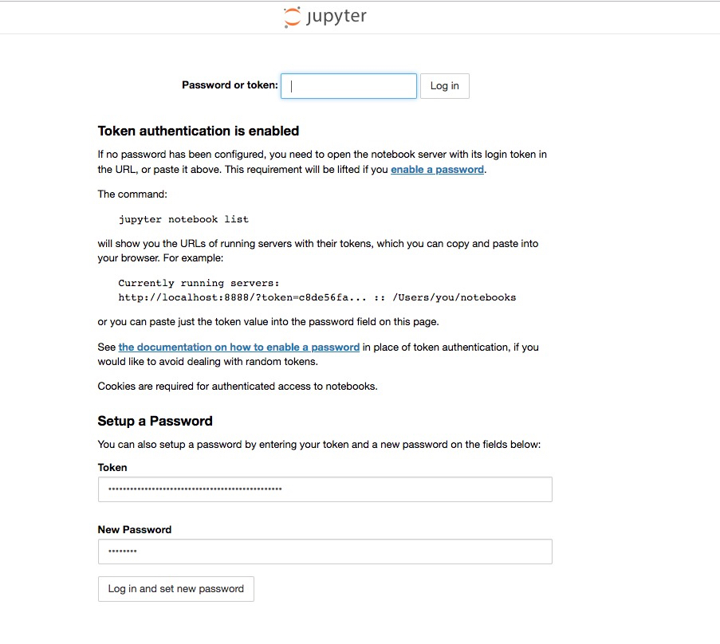
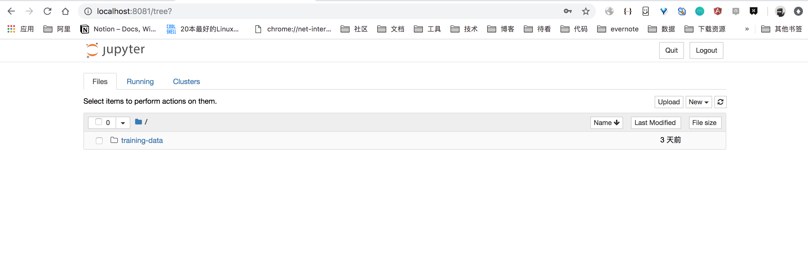

# 如何访问notebook

### 前提
* 集群管理员已经完成Kubernetes集群和GPU节点的配置 [环境搭建](../setup/README.md)
* 集群管理员已完成为数据科学家搭建工作环境（Notebook） [如何部署Notebook](../setup/SETUP_NOTEBOOK.md)
* 从集群管理员获取 Notebook的Pod IP，访问域名和地址，以及登录Token

### 访问Notebook

#### 从集群管理员获取Notebook的访问信息

集群管理员部署完工作环境 Notebook后， 可以获取到 Notebook 的访问地址。打印内容如下：

```
Notebook pod ip is 172.16.1.103
Notebook access token is <your token>
Ingress of notebook ip is 39.104.xx.xx
Ingress of notebook domain is foo.bar.com
```

其中含义：
* Pod IP 是Notebook 容器的访问IP
* access token是用于首次登录Notebook的密码，登录成功后可以选择继续使用token 登录访问。也可以选择设置新的密码
* Ingress IP 和 domain 是为Notebook配置的 Ingress 访问入口。 

您可以通过以下两种方式访问Notebook：
1. 通过sshuttle访问： 集群管理员需要提供一个和集群网络联通的跳板机。从集群管理员中获得跳板机IP/密码，和Notebook的Pod IP，通过sshuttle设置代理访问Notebook。
2. 通过Ingress访问： 集群管理员部署Notebook时会将Notebook 通过Ingress的公网SLB 提供服务， 仅限域名访问，并且支持Https加密。 保证Notebook在公网的安全性。 需要从集群管理员中获得Ingress IP 和 域名

根据您的实际情况和需求，选择合适的访问方式。

#### 通过sshuttle访问Notebook
1\. sshuttle是一个基于SSH的代理工具，通过它登录到跳板机，可以设置您对某个地址和网段的请求的代理。如果您没有安装过sshuttle ，可以通过以下命令安装：

```
sudo pip install sshuttle
```

2\. 由于Kubernetes的网络在专有网络VPC中，我们无法通过公网直接访问。可以通过 sshuttle 的方式，通过一台跳板机， 设置本地环境和线上kubernetes环境的网络代理。 命令如下：

```
sshuttle -r root@<跳板机IP> <代理的IP网段>
```

* 跳板机必须是和Kubernetes在相同的VPC下， 并且在同一个安全组中，保证相互之间的网络访问畅通。
* 通过集群管理员发送的Notebook Pod IP， 我们可以定义出代理的IP网段。 比如Pod IP是`172.16.1.103`， 我们可以将代理网段定义为 `172.16.1.0/24`

执行完成后会出现连接成功的提示
```
sshuttle -r root@39.104.xx.xx 172.16.1.0/16
client: Connected.
```

3\. 然后打开浏览器，可以直接访问地址 `http://<Pod IP>:8888`

#### 通过Ingress访问Notebook

1\. 如果您有自己的DNS解析，可以配置DNS解析，将Ingress的域名解析到对应的Ingress IP。 如果没有属于自己的DNS解析服务， 您也可以通过修改本地host文件的方式，将Ingress的域名解析到Ingress的IP。通过Ingress域名访问Notebook。
```
47.101.xx.xxx  foo.bar.com
<IP>         <你的Notebook域名>
```

2\. 设置完成hosts后，通过浏览器直接访问 `https://<Ingress Domain>` 即可访问。


### 登录Notebook
通过从集群管理员得到的Token，可以直接登录到Notebook中，也可以重置密码 <br />
<br />

登录完成后，进入Notebook界面。


您可以开始机器学习之旅了！