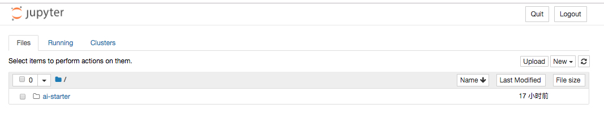
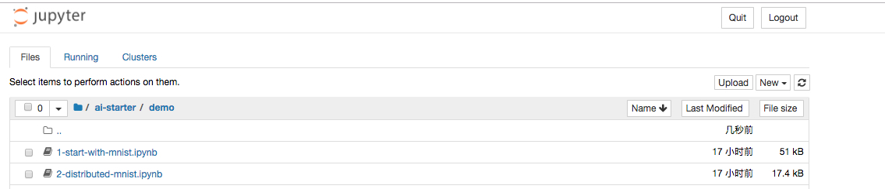

# 如何使用notebook
### 前提
* 您已经完成Kubernetes集群和GPU节点的配置 [环境搭建](../setup/README.md)
* 您可以正常访问Jupter Notebook [访问Notebook](ACCESS_NOTEBOOK.md)

### Notebook基础入门

1\. 首次访问Jupyter Notebook时， 浏览器会展示Notebook，显示home页面。可以看到`ai-starter`目录

2\. 点击`ai-starter`->`demo`, 可以看到一系列的notebook，您可以按照顺序逐个点击学习

