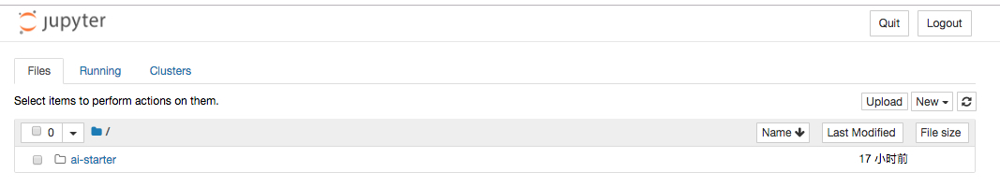
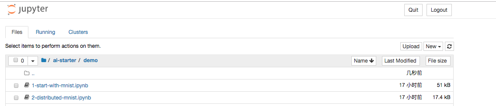
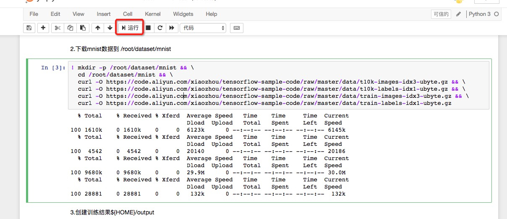

# 如何使用notebook
### 前提
* 集群管理员已经完成Kubernetes集群和GPU节点的配置 [环境搭建](../setup/README.md)
* 集群管理员已完成为数据科学家搭建工作环境（Notebook） [如何部署Notebook](../setup/SETUP_NOTEBOOK.md)
* 您已部署并可以正常访问Jupter Notebook [如何访问Notebook](./ACCESS_NOTEBOOK.md)

### Notebook基础入门

1\. 首次访问Jupyter Notebook时， 浏览器会展示Notebook，显示home页面。可以看到`ai-starter`目录

2\. 点击`ai-starter`->`demo`, 可以看到一系列的notebook，您可以按照顺序逐个点击学习

3\. 在Notebook的界面中，我们可以选择已有的代码块，通过点击上面的`运行` 按钮， 即可执行选中的代码块。

我们可以从第一个示例开始，比如第一个mnist的示例。 在Notebook中点击进入示例。 

[示例1，从Mnist开始](../../demo/1-start-with-mnist.ipynb)

