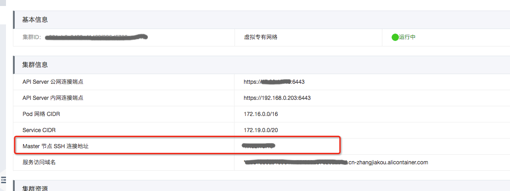
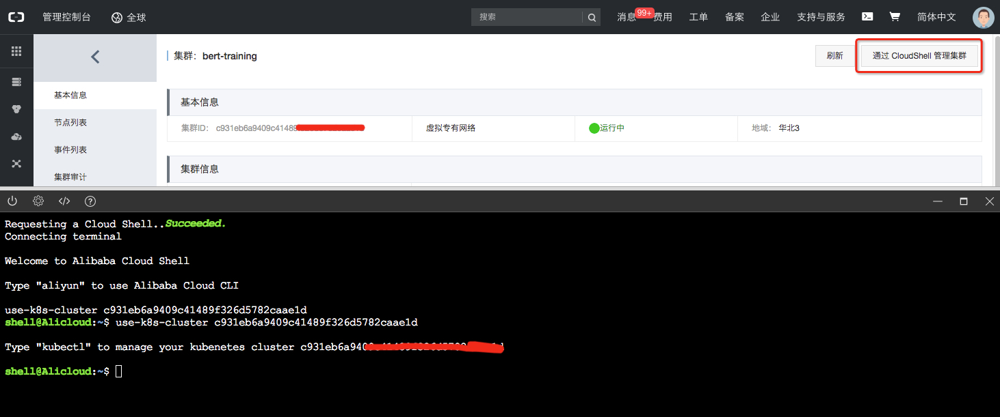

## 安装机器学习基础架构
Kubernetes支持CRD的方式定义不同类型的工作负载，用于分布式的应用生命周期管理。在深度学习领域比如MPI，ParameterServer模式。  
在深度学习解决方案中，我们支持了MPI，Tensorflow Parameter Server等模式。 想要在Kubernetes上运行他们，我们需要在集群中部署tj-job,mpi-operator, tf-job-dashboard 等基础服务。 为了简化安装，我们提供了安装脚本。  <br />

### 执行环境
由于安装脚本需要和Kubernetes集群交互，我们的环境需要安装好kubectl，并拥有一个创建应用权限的kubernetes用户凭证。 这个阶段通常由集群管理员执行。

##### 登录到master
我们可以选择登录到master机器上运行安装命令， 在控制台上查看Master节点SSH登录地址：<br />

通过SSH登录到Master节点

##### CloudShell
如果您未开放master的ssh端口，也可以通过cloudShell执行安装命令，[参考文档](https://help.aliyun.com/document_detail/100650.html)<br />


##### 笔记本上运行
您也可以在本地运行，需要安装kubectl，并下载集群凭证。 (安装Kubectl)[https://kubernetes.io/docs/tasks/tools/install-kubectl/]
在控制台集群详情中获取Kubeconfig。


### 安装基础架构
部署脚本在Github上开源，在部署脚本中，除了默认配置，我们还支持额外参数用于定制您的Notebook环境。

##### 安装Arena的依赖组件
```
curl -s https://raw.githubusercontent.com/AliyunContainerService/ai-starter/master/scripts/install_arena.sh | \
bash -s -- \
--prometheus
```

上述安装执行中，可以通过以下参数定制部署的依赖组件：
```
--prometheus     指定是否部署Prometheus，以及GPU监控的采集器和Grafana
```

##### 检查安装结果
```
# 查看arena 依赖
# kubectl -n arena-system get po
NAME                                      READY   STATUS    RESTARTS   AGE
mpi-operator-5f89ddc9bf-5mw4c             1/1     Running   0          1m
tf-job-dashboard-7dc786b7fb-t57wx         1/1     Running   0          1m
tf-job-operator-v1alpha2-98bfbfc4-9d66t   1/1     Running   0          1m
```