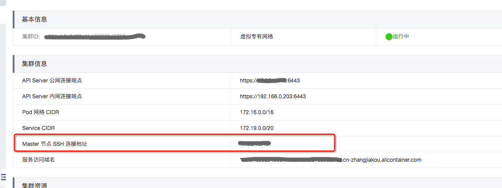
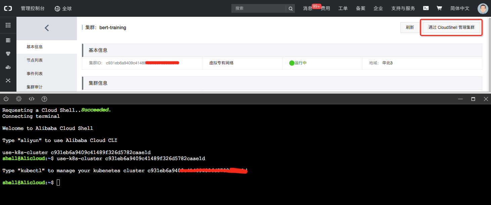
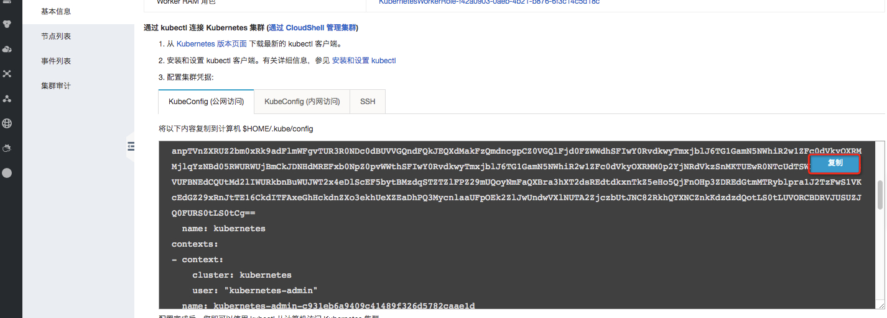
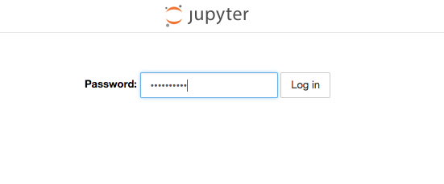
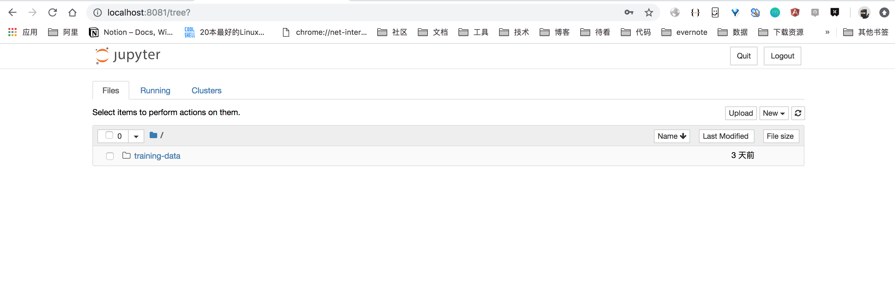

## 安装Notebook
为了简化安装，我们提供了安装脚本。 由于安装脚本需要和集群交互，我们需要在安装kubectl并配置好kubeconfig的环境中运行安装命令。 <br />
您可以选择通过CloudShell 执行命令， 也可以登录到Master上执行命令。

##### 登录到master
我们可以选择登录到master机器上运行安装命令， 在控制台上查看Master节点SSH登录地址：<br />

通过SSH登录到Master节点

##### CloudShell
如果您未开放master的ssh端口，也可以通过cloudShell执行安装命令，[参考文档](https://help.aliyun.com/document_detail/100650.html)<br />


##### 笔记本上运行
您也可以在本地运行，需要安装kubectl，并下载集群凭证。 (安装Kubectl)[https://kubernetes.io/docs/tasks/tools/install-kubectl/]
在控制台集群详情中获取Kubeconfig。


### 安装Arena
运行安装命令：
```
curl -s http://kubeflow.oss-cn-beijing.aliyuncs.com/bootstrap/install.sh | bash -s --
```

安装完成后，检查安装结果：

```
# 查看arena 依赖
# kubectl -n arena-system get po
NAME                                      READY   STATUS    RESTARTS   AGE
mpi-operator-5f89ddc9bf-5mw4c             1/1     Running   0          4d
tf-job-dashboard-7dc786b7fb-t57wx         1/1     Running   0          4d
tf-job-operator-v1alpha2-98bfbfc4-9d66t   1/1     Running   0          4d

# 查看notebook
# kubectl get po
NAME                              READY   STATUS      RESTARTS   AGE
arena-notebook-5bd4d8c5f7-jc7vf   1/1     Running     0          4d
```

### 访问Notebook

如果您本地是MAC或者LInux电脑，在笔记本上执行：
```
# curl -s http://kubeflow.oss-cn-beijing.aliyuncs.com/bootstrap/access_notebook.sh | bash -s --
Forwarding pod: default/arena-notebook-c4474d566-wxhx2, port: 8081
Open http://localhost:8081 in browser
Forwarding from [::1]:8081 -> 8888
Forwarding from 127.0.0.1:8081 -> 8888
```

访问notebook [http://localhost:8081](http://localhost:8081)， 输入密码，即可访问notebook（默认密码为  `mypassw0rd`  ）<br />
<br />


您可以开始机器学习之旅了！