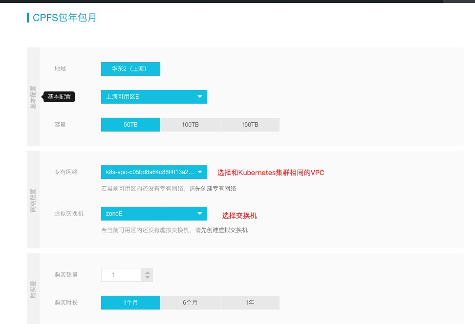
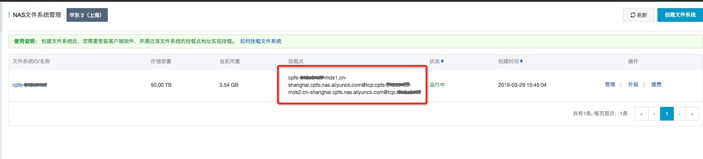
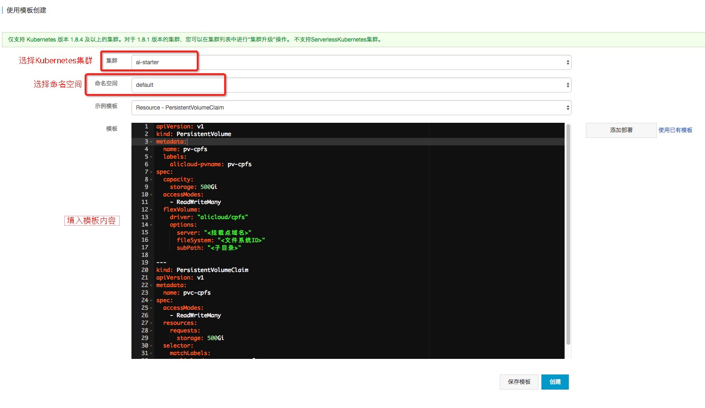

### 配置CPFS共享存储
CPFS（Cloud Paralleled File System）是一种并行文件系统。CPFS 的数据存储在集群中的多个数据节点，并可由多个客户端同时访问，从而能够为大型高性能计算机集群提供高 IOPS、高吞吐、低时延的数据存储服务。

随着高性能并行计算的大规模商业化，传统并行文件系统正面临诸多挑战，如存储资源急剧增长、成本高、运维管理复杂度大、大规模存储系统的稳定性以及性能无法随规模进行线性扩展等。CPFS应运而生。


### 创建阿里云CPFS实例
1\. 进入阿里云[NAS服务控制台](https://nas.console.aliyun.com/#/cpfs/list)，CPFS管理界面。<br />

2\. 选择对应创建文件系统，其中地域和可用区和Kubernetes集群选择一致。<br />


3\. 创建成功后，在控制台的列表中，我们可以看到CPFS实例，可以获得CPFS的挂载点和系统ID<br />

#### 配置Kubernetes中的存储卷和存储声明
1\. 回到容器[服务控制台](https://cs.console.aliyun.com/)。进入[通过模板创建页面](https://cs.console.aliyun.com/#/k8s/deploy/yaml?kind=pvc)<br />


模板中需要修改内容：
1. `CPFS挂载点`， `CPFS文件系统ID` 替换为前面所创建的CPFS实例内容
2. `子目录` 填写你需要的子目录。
3. `存储名称` 按照需求填写您的存储名，便于管理。

模板内容如下： 
```
apiVersion: v1
kind: PersistentVolume
metadata:
  name: <存储名>
  labels:
    alicloud-pvname: <存储名>
spec:
  capacity:
    storage: 500Gi
  accessModes:
    - ReadWriteMany
  flexVolume:
    driver: "alicloud/cpfs"
    options:
      server: "<CPFS挂载点>"
      fileSystem: "<CPFS文件系统ID>"
      subPath: "<子目录>"

---
kind: PersistentVolumeClaim
apiVersion: v1
metadata:
  name: <存储名>
spec:
  accessModes:
    - ReadWriteMany
  resources:
    requests:
      storage: 500Gi
  selector:
    matchLabels:
      alicloud-pvname: <存储名>
```