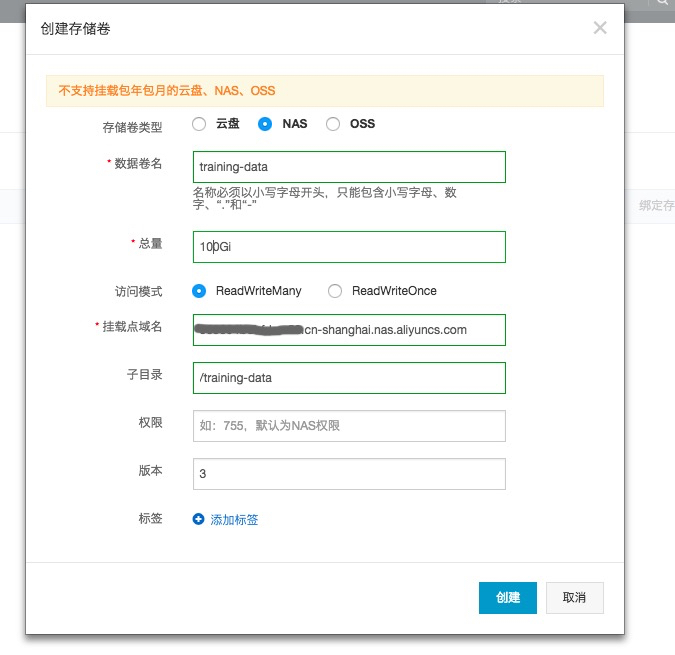
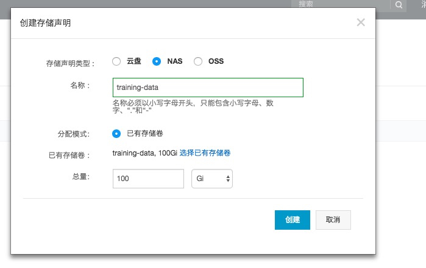

### NAS
阿里云文件存储（Network Attached Storage，简称 NAS）是面向阿里云 ECS 实例、E-HPC 和容器服务等计算节点的文件存储服务。阿里云NAS服务具有无缝集成，共享访问，安全控制等特性，非常适合跨多个 ECS、E-HPC 或容器服务实例部署的应用程序访问相同数据来源的应用场景。

#### 创建NAS实例，配置挂载点

1\. 进入阿里云NAS服务控制台([https://nas.console.aliyun.com/#/ofs/list](https://nas.console.aliyun.com/#/ofs/list))。选择和Kubernetes集群对应的地域 

2\. 选择对应创建文件系统，地域和可用区和Kubernetes集群选择一致。 

3\. 创建挂载点，同样选择和集群一致的VPC和VSwitch 

4\. 创建成功后，在控制台详情中能够查看NAS实例的挂载地址 

#### 配置Kubernetes中的存储卷和存储声明

1\. 回到容器服务控制台([https://cs.console.aliyun.com/](https://cs.console.aliyun.com/))，我们在容器集群中创建存储卷，将来源设置为NAS。 

2\. 在容器控制台中选择 集群 -> 存储卷 -> 创建。 填入上一步中创建的NAS实例的挂载点地址，并设置子目录。  

3\. 创建存储卷完成，继续创建存储声明（PVC），我们设置对应的名称， 并且需要刚刚的存储卷。  

4\. 完成创建后，在存储声明的列表中，可以看到刚刚创建的存储声明实例。

